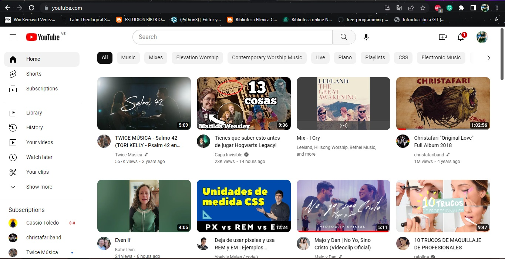

# YouTube Clone

> Set up the project, the goal here is to master the tools and best practices about Linter, Gitflow, pair programming while we make a clone of YouTube interface. 

Original Design

## Built With

- HTML
- CSS

### Prerequisites
- GIT 

### Setup
- Clone this [Repository](https://github.com/danyhoshi/youtube-clone.git) in order to get a copy of this project
- From develop branch, open the index.html file with your browser.

## Authors

👤 **Author1**

- GitHub: [@danyhoshi](https://github.com/danyhoshi)
- LinkedIn: [@LinkedIn](https://www.linkedin.com/in/daniela-gonz%C3%A1lez-ba16a556/)
- Twitter: [@dany_hoshi](https://twitter.com/Dany_hoshi)

👤 **Author2**

- GitHub: [@albinpirela](https://github.com/Albinpirela)
- LinkedIn: [@LinkedIn](https://www.linkedin.com/in/albin-pirela-21528a222/)
- Twitter: [@AlbinPirela](https://twitter.com/243f3669846b4b5)

## 🤝 Contributing

Contributions, issues, and feature requests are welcome!

Feel free to check the [issues page](../../issues/).

## Show your support

Give a ⭐️ if you like this project!

## Acknowledgments

- Our Studying group!

## 📝 License

This project is [MIT](./MIT.md) licensed.
